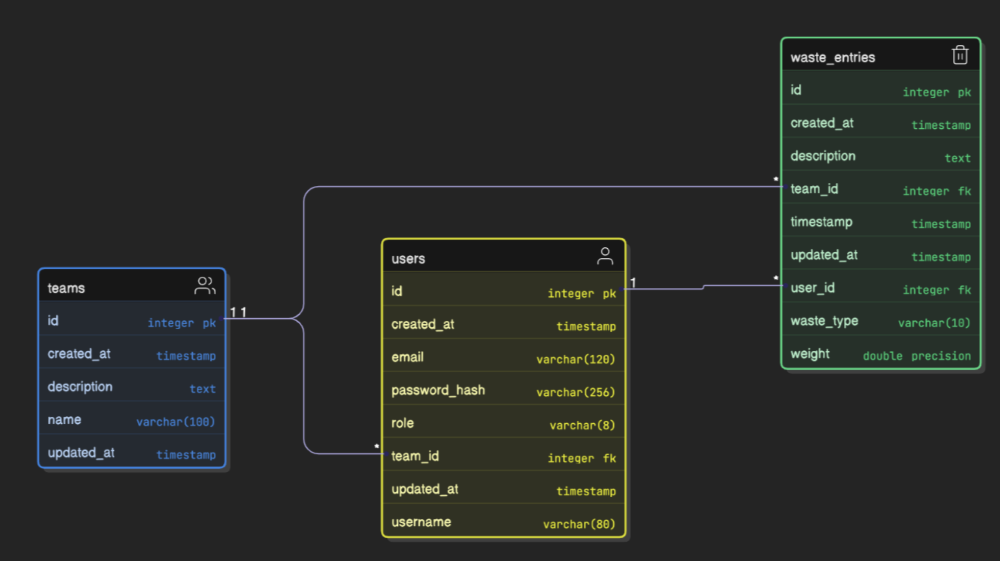

# Waste Management System - Architecture

This document outlines the system architecture. See [PERMISSIONS.md](PERMISSIONS.md) for permission details and [README.md](README.md) for setup instructions.

## System Structure

The system follows a layered architecture:

```
┌─────────────────┐
│    API Layer    │  HTTP requests/responses
├─────────────────┤
│  Service Layer  │  Business logic
├─────────────────┤
│   Data Layer    │  Database interactions
└─────────────────┘
```

### Key Components

1. **Flask Application Factory** (`app/__init__.py`)
   - Configuration and extension setup
   - Blueprint registration

2. **Models** (`app/models/`)
   - Database schema
   - Business rules

3. **Routes** (`app/routes/`)
   - API endpoints
   - Input validation

4. **Utilities** (`app/utils/`)
   - Auth helpers
   - Permission decorators

## Database Schema

The system uses PostgreSQL with the following schema and relationships:



### Entity Relationships

- Users belong to Teams and Roles
- Teams have many Users and WasteEntries
- Roles have many Permissions (many-to-many)
- WasteEntries belong to Users and Teams

## Permission Model

Each action requires a specific permission. Roles are collections of permissions assigned to users.

### Permission Types

| Category       | Examples                    | Description                               |
|----------------|----------------------------|-------------------------------------------|
| Waste Entries  | add_wasteentry, view_wasteentry | Control waste entry operations       |
| Analytics      | view_analytics             | Access to reporting features             |
| User Management| manage_user, view_users    | User account operations                  |
| Team Management| view_teams, add_team       | Team operations                          |
| Role Management| edit_role, view_roles      | Role configuration                       |

### Default Roles

| Role     | Access Level                                     |
|----------|--------------------------------------------------|
| Admin    | Full system access                              |
| Manager  | Team-level management and analytics             |
| Employee | Personal waste entry management                 |

### Superuser Flag

Users with `is_superuser=True` bypass permission checks entirely.

### Implementation

The permission system uses:

1. **Model Relationships**: Users-Roles-Permissions connections
2. **Permission Decorator**: `@permission_required('permission_code')`
3. **Data Filtering**: Queries filtered by user's role and permissions

```python
# Route protection example
@waste_bp.route('', methods=['GET'])
@permission_required('view_wasteentry')
def get_waste_entries():
    # Implementation...
```

```python
# Data filtering example
if user.is_superuser:
    # No restrictions
elif user.has_permission('view_analytics'):
    query = query.filter(WasteEntry.team_id == user.team_id)  # Team scope
else:
    query = query.filter(WasteEntry.user_id == user.id)  # User scope
```

## API Structure

Routes are organized by resource:
- `/api/auth/*`: Authentication
- `/api/teams/*`: Team management
- `/api/users/*`: User management
- `/api/waste/*`: Waste entries and analytics
- `/api/roles/*`: Role management

## Security Measures

- JWT authentication
- Password hashing
- Permission-based authorization
- Input validation
- Parameterized queries