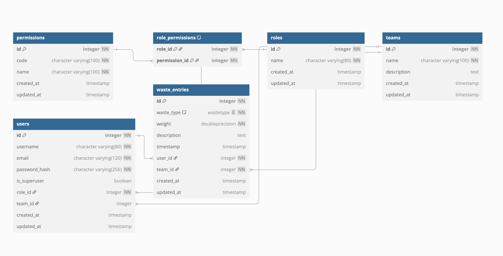

# Waste Management System - Architecture Overview

## System Structure

The waste management system follows a layered architecture with clear separation of concerns:

```
┌─────────────────┐
│    API Layer    │  Routes handle HTTP requests and responses
├─────────────────┤
│  Service Layer  │  Business logic, permissions, and data manipulation
├─────────────────┤
│   Data Layer    │  Database models and data access
└─────────────────┘
```

### Key Components

1. **Flask Application Factory** (`app/__init__.py`)
   - Provides application configuration
   - Initializes extensions (SQLAlchemy, JWT, Migrations)
   - Registers route blueprints

2. **Models** (`app/models/`)
   - Define database schema
   - Implement business rules and constraints
   - Handle data serialization through to_dict methods

3. **Routes** (`app/routes/`)
   - Handle API requests
   - Validate input
   - Apply authorization decorators
   - Return appropriate responses

4. **Utilities** (`app/utils/`)
   - Authentication helpers
   - Decorators for permission checks
   - Response formatting

## Database Schema

The system uses PostgreSQL with the following schema and relationships:



### Entity Relationships

- A **User** belongs to one **Team** (optional for admin)
- A **Team** has many **Users**
- A **WasteEntry** belongs to one **User** and one **Team**
- A **Team** has many **WasteEntries**
- A **User** has many **WasteEntries**

## Permission Model

The system implements a role-based access control (RBAC) model with three roles:

| Role     | Permissions                                      |
|----------|--------------------------------------------------|
| Admin    | Full access to all entities and operations       |
| Manager  | Access to team's data and management functions   |
| Employee | Can only create and view their own waste entries |

### Implementation

Permissions are enforced through Flask route decorators in `app/utils/auth.py`:

1. **Authentication** (`@jwt_required()`)
   - Verifies user identity through JWT tokens
   - Makes user ID available via `get_jwt_identity()`

2. **Role-based Authorization**
   - `@admin_required()`: Ensures only admin users can access
   - `@manager_required()`: Ensures admin or manager users can access
   - `@employee_required()`: Ensures any authenticated user can access
   - `@team_access_required()`: Ensures user has access to specific team resources

3. **Resource-based Authorization**
   In route handlers, additional filtering is applied based on user role:

   ```python
   # Example from get_waste_entries():
   if team_id and user.is_admin():
       # Admin can filter by any team_id
       query = query.filter(WasteEntry.team_id == team_id)
   elif not user.is_admin() and user.is_manager():
       # Managers can only see their team's entries
       query = query.filter(WasteEntry.team_id == user.team_id)
   elif not user.is_admin() and not user.is_manager():
       # Employees can only see their own entries
       query = query.filter(WasteEntry.user_id == user.id)
   ```

This multi-layered permission model ensures data isolation between teams and enforces proper access control based on user roles. It maintains security and privacy throughout the application by applying permissions at both the route level and the data query level. 